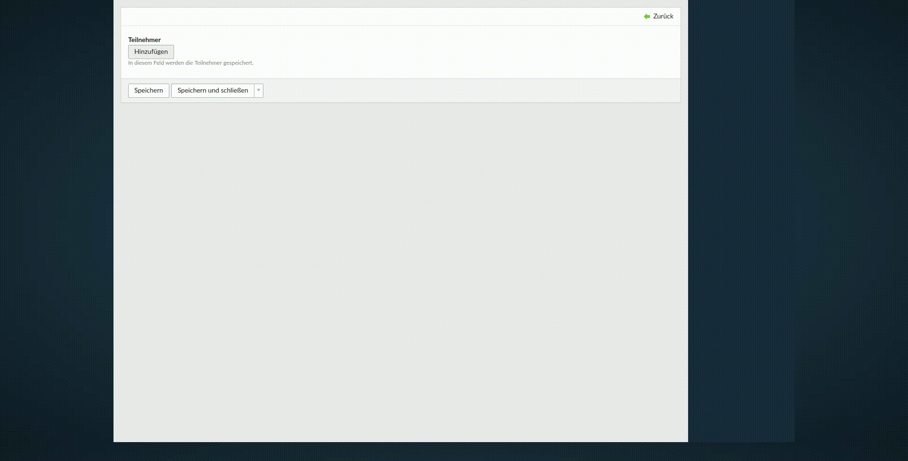

# Multi Column Editor bundle

[](https://packagist.org/packages/heimrichhannot/contao-multi-column-editor-bundle)
[](https://packagist.org/packages/heimrichhannot/contao-multi-column-editor-bundle)
[](https://travis-ci.org/heimrichhannot/contao-multi-column-editor-bundle/)
[](https://coveralls.io/github/heimrichhannot/contao-multi-column-editor-bundle)

This module offers an input type for editing one or more records in backend and frontend.



## Features
* input type to edit one or multiple records
* support for backend and frontend
* [Encore bundle](https://github.com/heimrichhannot/contao-encore-bundle) support

## Setup

### Install 

Install with composer: 

    composer require heimrichhannot/contao-multi-column-editor-bundle

### Technical instructions

Use the inputType "multiColumnEditor" for your field.

```
'someField' => array(
    'label'     => &$GLOBALS['TL_LANG']['tl_my_table']['someField'],
    'inputType' => 'multiColumnEditor',
    'exclude'   => true,
    'eval'      => array(
        'multiColumnEditor' => array(
            // set to true if the rows should be sortable (backend only atm)
            'sortable' => true,
            'class' => 'some-class',
            // set to 0 if it should also be possible to have *no* row (default: 1)
            'minRowCount' => 2,
            // set to 0 if an infinite number of rows should be possible (default: 0)
            'maxRowCount' => 5,
            // defaults to false
            'skipCopyValuesOnAdd' => false,
            'editorTemplate' => 'multi_column_editor_backend_default',
            // add palette and subpalette if you need supalettes support
            'palettes'    => [
                '__selector__' => ['field1'],
                'default'      => 'field1',
            ],
            'subpalettes' => [
                'field1'  => 'field2', // key selector
                'field1_10' => 'field3' // key_value selector
            ],
            'fields' => array(
                // place your fields here as you would normally in your DCA
                // (sql is not required)
                'field1' => [
                    'label' => 'field 1',
                    'inputType' => 'text',
                    'eval' => ['groupStyle' => 'width:150px', 'submitOnChange' => true]
                ],
                'field2' => [
                    'label' => 'field 2',
                    'inputType' => 'text',
                    'eval' => ['groupStyle' => 'width:150px']
                ],
                'field3' => [
                    'label' => 'field 3',
                    'inputType' => 'text',
                    'eval' => ['groupStyle' => 'width:150px']
                ]
            )
        )
    ),
    'sql'       => "blob NULL"
),
```

### Add support for special fields (like fileTrees) in Rocksolid Custom Content Elements (RSCE)

Simply add the following to your project's `config.php`:

```
$GLOBALS['MULTI_COLUMN_EDITOR']['rsce_fields'] = array_merge(
    is_array($GLOBALS['MULTI_COLUMN_EDITOR']['rsce_fields']) ? $GLOBALS['MULTI_COLUMN_EDITOR']['rsce_fields'] : [], [
        'tl_content' => ['linkImage']
    ]
);
```

where this would be your RSCE config:

```
$element = [
     // ...
    'fields'          => [
        'links'              => [
            'label'     => &$GLOBALS['TL_LANG']['tl_content']['links'],
            'inputType' => 'multiColumnEditor',
            'eval'      => [
                'tl_class'          => 'long clr',
                'multiColumnEditor' => [
                    'minRowCount' => 0,
                    'fields'      => [
                        'linkImage'     => [
                            // ...
                            'inputType'               => 'fileTree',
                        ],
    // ...
```

## Developers

### Assets
Bundle assets are provided as [yarn package](https://yarnpkg.com/en/package/@hundh/contao-multi-column-editor-bundle). Sources and Javascript documentation can be found in [`src/Resources/npm-package`](/tree/master/src/Resources/npm-package).
