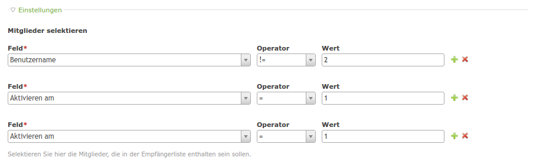

# Multi Column Editor bundle

This module offers an input type for editing one or more records in backend and frontend.

The module is similar to [menatwork/MultiColumnWizard](https://github.com/menatwork/MultiColumnWizard) but works in frontend as well (in combination with the form generator module [heimrichhannot/contao-formhybrid](https://github.com/heimrichhannot/contao-formhybrid ).



## Features

### Technical instructions

Use the inputType "multiColumnEditor" for your field.

```
'someField' => array(
    'label'     => &$GLOBALS['TL_LANG']['tl_my_table']['someField'],
    'inputType' => 'multiColumnEditor',
    'eval'      => array(
        'multiColumnEditor' => array(
            // set to true if the rows should be sortable (backend only atm)
            'sortable' => false,
            'class' => 'some-class',
            // set to 0 if it should also be possible to have *no* row (default: 1)
            'minRowCount' => 2,
            // set to 0 if an infinite number of rows should be possible (default: 0)
            'maxRowCount' => 5,
            // defaults to false
            'skipCopyValuesOnAdd' => false,
            'fields' => array(
                // place your fields here as you would normally in your DCA
                // (sql is not required)
                'field1' => [
                	'label' => 'field 1'
                	'inputType' => 'text',
                	'eval' => ['groupStyle' => 'width:150px']
                ]
            )
        )
    ),
    'sql'       => "blob NULL"
),
```
